<div align="center">
  <h1>🛡️ Chakhdi Local Proxy & DNS Server</h1>
  <p><strong>Custom Node.js HTTPS Proxy with Live Web Dashboard</strong></p>

  <p>
    <a href="#"></a>
    <a href="#"></a>
    <a href="#"></a>
    <a href="#"></a>
  </p>
</div>

The **Chakhdi Local Proxy & DNS Server** is a highly advanced, locally hosted network management system designed for robust traffic control, privacy, and insights. 

Featuring built-in ad-blocking, malicious domain filtering (powered by lightweight SQLite3 database blocklists), automatic system proxy mapping, and a sleek live metrics dashboard over HTTPS—it is built to keep your system secure while giving you visual analytics over WebSocket connections.

---

## ✨ Key Features

- **Advanced HTTPS Proxy:** Intercepts, routes, and bumps traffic accurately on port `5309`.
- **Integrated DNS Server:** Listens on port `53` to resolve DNS queries and discard connections to known malicious domains before a connection is even negotiated.
- **Dynamic Blocklists:** Loads millions of domains directly into a fast, in-memory SQLite3 database for zero-latency blocking.
- **Live Monitoring Dashboard:** Real-time Web UI served over HTTPS, using Express and WebSockets (`socket.io`), to let you monitor inbound and outbound queries visually.
- **Auto-Configuring System Hooks:** Modifies the OS network adapters on-the-fly to set the DNS and Proxy to `127.0.0.1` and manages Windows Firewall block rules. Restores configuration automatically on shut down.
- **Certificate Authority Engine:** Uses `node-forge` for automatic Certificate generation, SSL interception, decryption, and secure key loading.
- **Network Kill Switch:** Instantly enforces Windows Firewall configurations to drop all outgoing internet traffic if the proxy goes offline or is illegally bypassed.

---

## 📸 Dashboard Previews

Experience the comprehensive monitoring and control panel for this network setup.

<div align="center">
  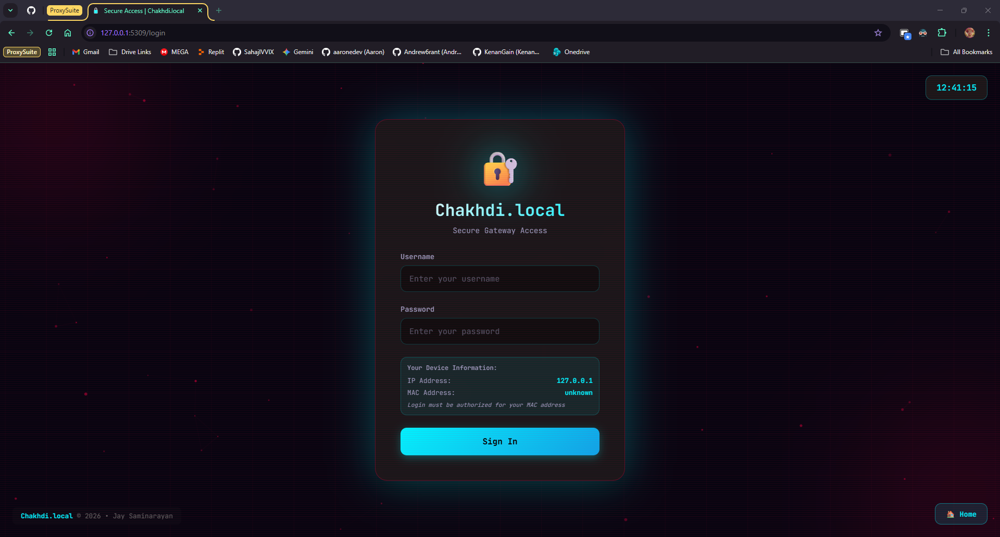
  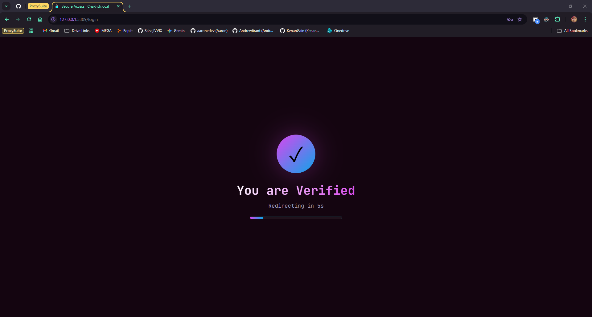
  <br/>
  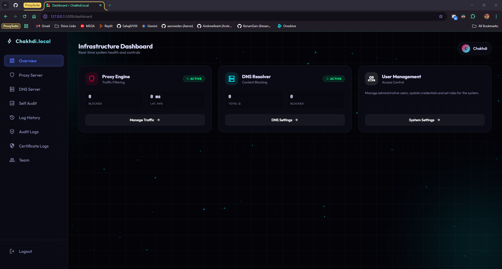
  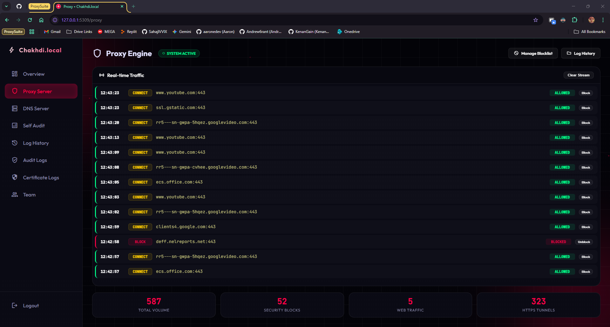
  <br/>
  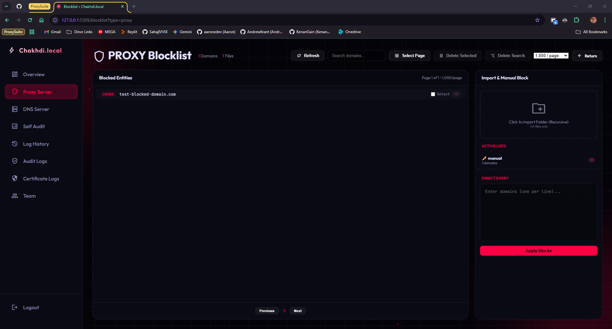
  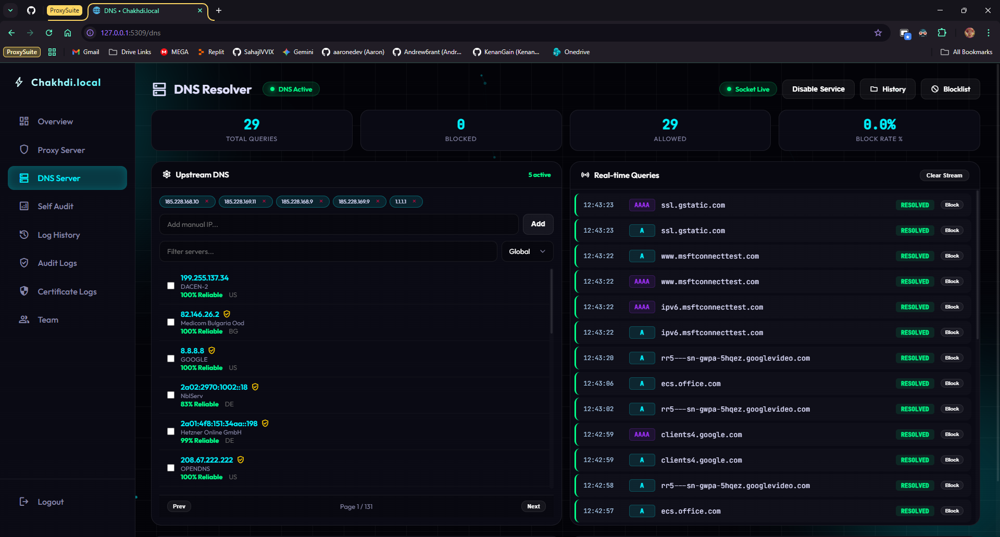
  <br/>
  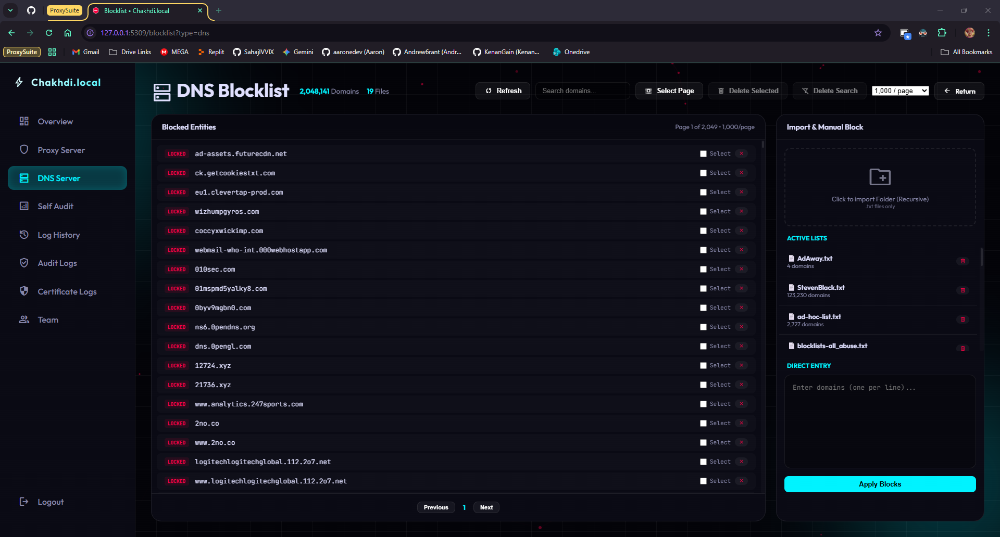
  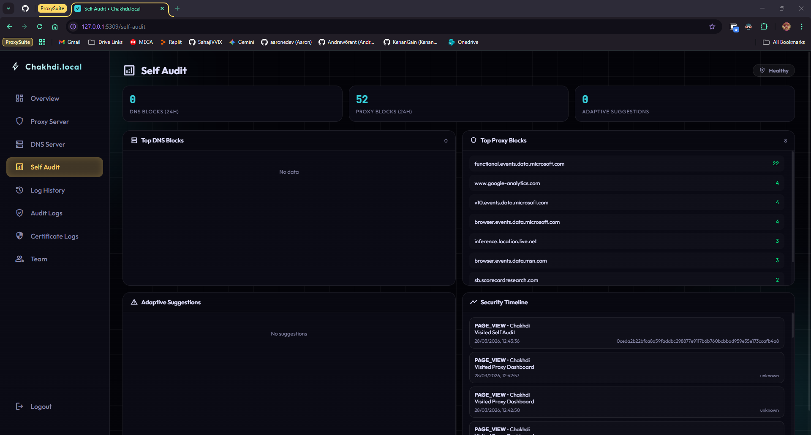
  <br/>
  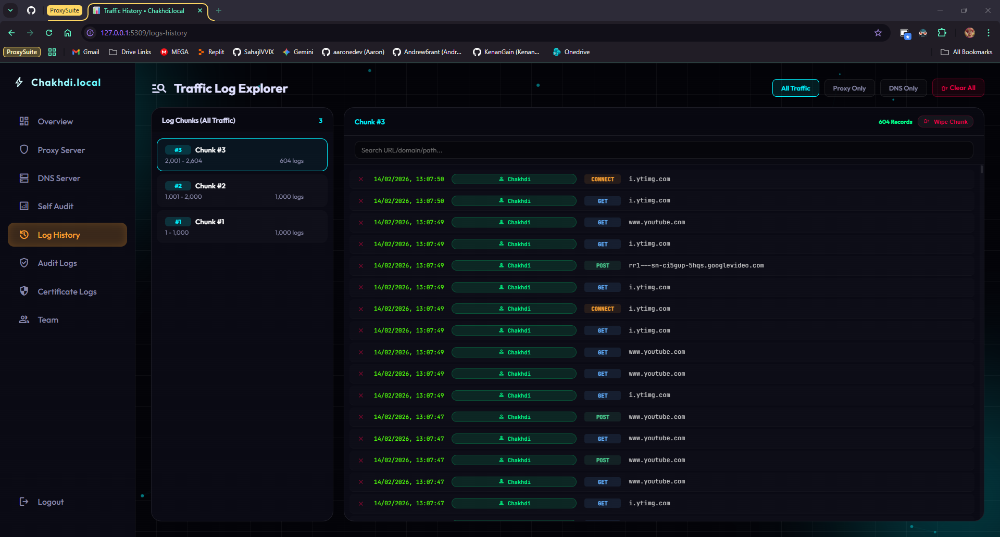
  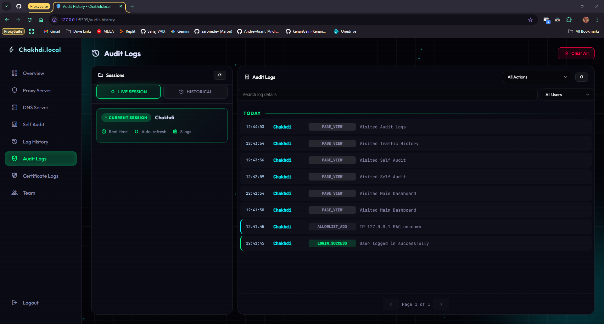
  <br/>
  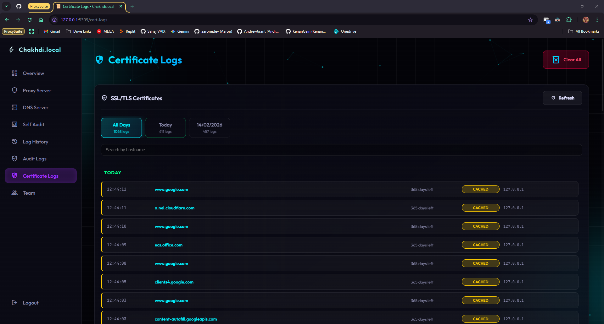
  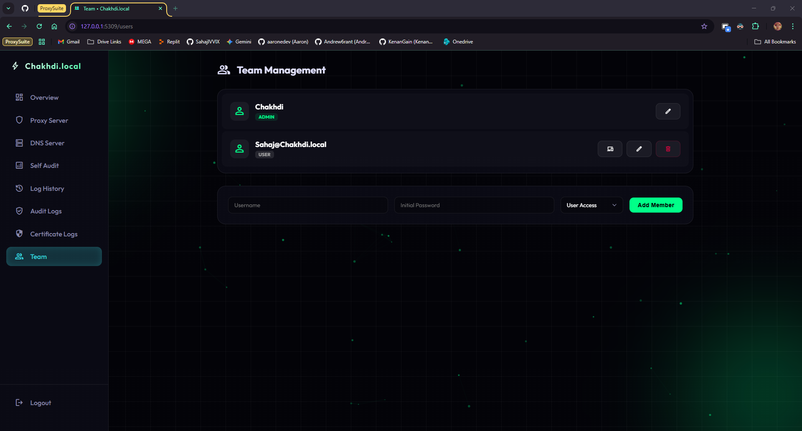
</div>

---

## 🛠️ Tech Stack & Architecture

- **[Node.js](https://nodejs.org/)**: Powers the backend networking and async non-blocking proxying.
- **[dns2](https://github.com/song940/node-dns)**: Core DNS protocol parsing, query management, and customized resolution.
- **[http-proxy](https://github.com/http-party/node-http-proxy)**: Extremely performant HTTP & HTTPS proxy relay.
- **[socket.io](https://socket.io/)**: Real-time bidirectional event-based communication for pushing live metrics directly to the Web Interface.
- **[SQLite3](https://www.sqlite.org/index.html)**: Lightning-fast, unbloated data indexing for instant DNS filtering.
- **[node-forge](https://github.com/digitalbazaar/forge)**: Certificate and cryptography management toolkit for establishing secure local channels natively.

---

## ⚙️ Deployment & Quick Start

### 1. Prerequisites
- **Node.js**: `v18.0.0` or higher (*Local NodeJS binaries available inside `node-24.13.0` if you lack a global runtime*)
- **Windows OS**: Recommended due to its dependency on `netsh` Firewall commands for the Kill Switch mechanism.

### 2. Installation
Clone the repository to your host machine and initialize the packages:
```bash
git clone https://github.com/YourUsername/Server.Chakhdi.local.git
cd Server.Chakhdi.local

# Install local dependencies
npm install
```

### 3. Environment Context
Prepare the security environment variables. Copy the `.env.example` file and configure your credentials.
```bash
copy .env.example .env
```

### 4. Running the Server

Start monitoring and routing natively using the default start script. 
> **⚠️ IMPORTANT:** Run your terminal or command prompt as **Administrator** so the system can set proper DNS adaptors and Firewall rules out-of-the-box.

```bash
npm start
```
*For active development (utilizing `nodemon`):*
```bash
npm run dev
```

### 5. Accessing the Control Panel
Upon successful deployment, your command line will output that the web UI is alive. Access the dashboard safely over the localized HTTPS portal:
➡️ **`https://server.chakhdi.local`**

---

## 📦 Building a Standalone Executable

Do you need to deploy this to a separate Windows system that lacks an explicit Node.js runtime? Use the pre-configured `pkg` script to generate a single portable executable.

```bash
npm run build
```
The final standalone binary will be built to: `dist/chakhdi-proxy.exe`. You can directly launch this on any `x64` Windows architecture OS!

---

## 🛡️ External Firewall Configuration

### For the Hosting Server:
To allow other client PCs on your network to use this system as a DNS Resolver, you must manually open Port 53:
*(Open Administrative Prompt)*
```powershell
netsh advfirewall firewall add rule name="Chakhdi DNS UDP 53" dir=in action=allow protocol=UDP localport=53
netsh advfirewall firewall add rule name="Chakhdi DNS TCP 53" dir=in action=allow protocol=TCP localport=53
```

### For Connected Client PCs:
If routing Client Proxy Traffic to this system, bypass internal and LAN subnets to prevent routing loops. In your PC's Proxy Settings (Proxy Exceptions / Exclusions), insert the following array:
```text
server.chakhdi.local;*.local;10.*;172.16.*;172.17.*;172.18.*;172.19.*;172.20.*;172.21.*;172.22.*;172.23.*;172.24.*;172.25.*;172.26.*;172.27.*;172.28.*;172.29.*;172.30.*;172.31.*;192.168.*
```

---

## 🐛 Troubleshooting

**"Kill switch enable failed" / "Command failed: netsh advfirewall"**
- The network proxy is attempting to set an outbound Windows Firewall safety rule, but access is denied. Please right-click and **"Run as Administrator"** on your command prompt!

**"DNS Error: Address in Use"**
- Another application is likely using Port `53`. Ensure no other DNS processes or localized IIS servers are overlapping the binding connection.

---

## 📝 License
This project is licensed under the **[MIT License](LICENSE)**.
